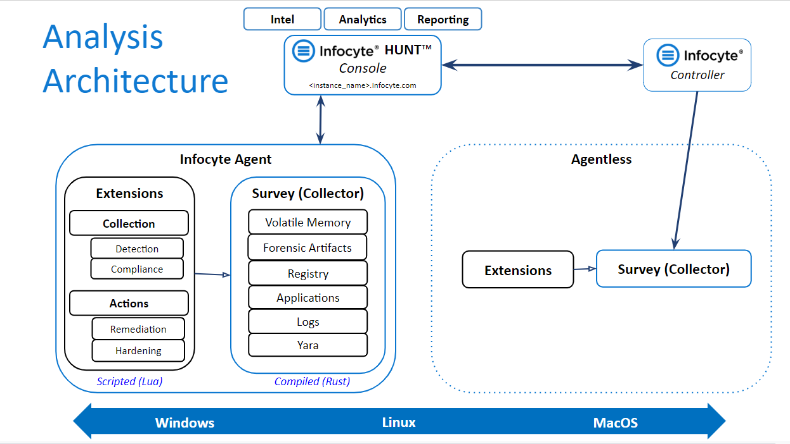
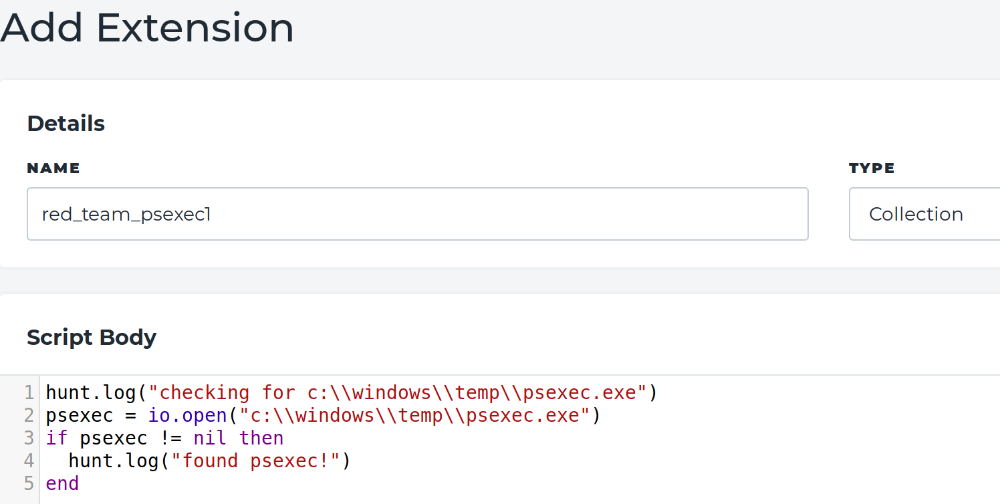

# Infocyte Extensions
The [Infocyte](https://www.infocyte.com) platform is an agentless Threat Hunting
and Incident Response platform. In addition to the plethora of native host data
collection and analysis provided by default, users are able to define their own
collections and response actions to be performed on endpoints and servers. Here
you will find examples and contributed extensions which can be easily loaded
into the Infocyte platform.

**This repo contains:**
- [Extension Overview](#overview)
- [Usage Instructions](#usage)
- [API Reference](#api)
- [Examples](#examples)
- [Contributing Instructions](#contributing)
- [Feature Requests](#feature-requests)
- [Learn Lua](#learn-lua)

### Overview
The Infocyte extension system is built on top of [Lua 5.3](https://www.lua.org),
which provides an easy to deploy, cross platform, and feature-rich library of 
built-in functions. This includes file system, string , I/O, math, operations
(among others). Refer to the 
[Lua Reference Manual](https://www.lua.org/manual/5.3/contents.html) for
detailed documentation on usage or you can click [here](#learn-lua) for Lua 
tutorials.

In addition to the Lua standard library, Infocyte exposes capabilities
of its' agent and endpoint collector ("Survey") that make interacting with host
operating systems more powerful and convenient. This extended language is the
real engine that powers the extension system. With these enhancements, extension
authors can easily perform web requests, access the windows registry, terminate
running processes, even add items to the existing result set retrieved
by the platform's standard host collection routine. Examples also exist to call
other types of scripts like Powershell, Python or Bash depending on availability
of the relevant interpreter on the host.

There are currently two types of extensions supported: Collection & Action.

##### Collection
Collection extensions extend what is collected or inspected at scan time. This 
can be additional registry keys or files to be analyzed or YARA signatures to be
used on the host-side. Threat statuses can be flagged based on your logic and
text fields are available for arbitrary data collection up to 3MB in size. For
large evidence collection, we will have functions available to push data direct
from the host to a user provided AWS S3 Bucket, sFTP, or SMB share.

##### Action
Action Extensions cause direct changes to remote systems. These can be
remediation actions like host isolation, malware killing, host hardening
routines (like changing local logging configurations), or other installing
3rd party tools.





### Usage
Configuring of new extensions is a very simple process. After logging into your
Infocyte instance (with
an administrator role) simply navigate to `Admin->Extensions`. Here you can see
the list of current extensions
loaded into the system:


Clicking on an existing item will allow you to view the extension body and edit
it. To add a new extension click
the `Add Extension`, this will take to you to the extension editor:



You can copy and paste an extension from this repository (check the 
[contrib folder](/contrib) for submitted extensions), or start from scratch
and write your own.

Hitting save will perform a syntax validation and if everything checks out, will
save the newly created extension for use. To make the extension available to 
deploy during a scan, make sure you click the `Active` column to enable it as an
option.

*Note: The roadmap has us separating action extensions into their own workflow
within the interface.*

### API Reference
Below is documentation surrounding the extended Lua API developed and provided
by Infocyte. This API can be broken down into various parts:

- [Logging and Output](#logging-and-output)
- [Environmental](#environmental)
- [Network](#network)
- [Web](#web)
- [Process](#process)
- [Registry](#registry)
- [Hashing](#hashing)
- [Recovery](#recovery)
- [Yara](#yara)
- [Extras](#extras)

#### Logging and Output
These functions provide the only methods to capture output from scripts that are
run. Using standard Lua `print()` or `io.write()` will cause data to be written
to standard output, but not captured and transmitted back to the Infocyte
platform.

| Function | Description |
| --- | --- |
| **hunt.log(string)** | Captures the input value and saves it to the extension output object to be viewed later in the Infocyte console. |
| **hunt.warn(string)** | Writes a string to the `warning` log level of the survey, as well as capture to the script output. |
| **hunt.error(string)** | Writes a string to the `error` log level of the survey, as well as capture to the script output. |
| **hunt.verbose(string)** | Writes a string to the `verbose` log level of the survey, as well as capture to the script output. |
| **hunt.debug(string)** | Writes a string to the `debug` log level of the survey, as well as capture to the script output. |

#### Environmental

**Example:**
```lua
host_info = hunt.env.host_info()
hunt.print("OS: " .. host_info:os())
hunt.print("Architecture: " .. host_info:arch())
hunt.print("Hostname: " .. host_info:hostname())
hunt.print("Domain: " .. host_info:domain())
```

| Function | Description |
| --- | --- |
| **hunt.env.os()** | Returns a string representing the current operating system. |
| **hunt.env.is_linux()** | Returns a boolean indicating the system is linux. |
| **hunt.env.is_windows()** | Returns a boolean indicating the system is windows. |
| **hunt.env.is_macos()** | Returns a boolean indicating the system is macos. |
| **hunt.env.host_info()** | Returns a table containing more host information.|
| **hunt.env.has_python()** | Returns a boolean indicating if any version of Python is available on the system. |
| **hunt.env.has_python2()** | Returns a boolean indicating if Python 2 is available on the system. |
| **hunt.env.has_python3()** | Returns a boolean indicating if Python 3 is available on the system. |
| **hunt.env.has_powershell()** | Returns a boolean indicating if Powershell is available on the system. |
| **hunt.env.has_sh()** | Returns a boolean indicating if the bourne shell is available on the system. |

#### Network

| Function | Description |
| --- | --- |
| **hunt.net.api()** | Returns a string value of the HUNT instance URL the script is currently attached to. This can be empty if the script is being executed as a test or off-line scan. |
| **hunt.net.api_ipv4()** | Returns a list of IPv4 addresses associated with the HUNT API, this list can be empty if executed under testing or as an off-line scan. |
| **hunt.net.api_ipv6()** | Returns a list of IPv6 addresses associated with the HUNT API, this list can be empty if executed under testing or as an off-line scan; |
| **hunt.net.nslookup(string)** | Returns a list of IP addresses associated with the input item. This will be empty if lookup fails. |
| **hunt.net.nslookup4(string)** | Returns a list of IPv4 addresses associated with the input item. This will be empty if lookup fails. |
| **hunt.net.nslookup6(string)** | Returns a list of IPv6 addresses associated with the input item. This will be empty if lookup fails. |


#### Web
For web requests, you can instantiate a web client to perform http(s) methods. An optional proxy and header field is also available.
The format for using a proxy is `user:password@proxy_address:port`.

##### Example 1:
```lua
client = hunt.web.new("https://my.domain.org")
client:proxy("myuser:password@10.11.12.88:8888")
client:add_header("authorization", "mytokenvalue")

client:download_file("./my_data_file.txt")
data = client:download_data()
```

| Function | Description |
| --- | --- |
| **get()** | Sets the HTTP request type as GET (default) |
| **post()** | Sets the HTTP request type as POST |
| **enable_tls_verification()** | Enforces TLS certificate validation (default) |
| **disable_tls_verification()** | Disables TLS certificate validation |
| **proxy(config: string)** | Configures the client to use a proxy server |
| **download_data()** | Performs the HTTP request and returns the data as bytes |
| **download_string()** | Performs the HTTP request and returns the data as a string |
| **download_file(path: string)** | Performs the HTTP request and  saves the data to `path` |
| **add_header(name: string, value: string)** | Adds an HTTP header to the client request 


#### Process

**Example:**
```lua
procs = hunt.process.list()
for _, proc in pairs(procs) do
    hunt.print("Found pid " .. proc:pid() " .. " @ " .. proc:path())
    hunt.print("- Owned by: " .. proc:owner())
    hunt.print("- Started by: " .. proc:ppid())
    hunt.print("- Command Line: " .. proc:cmd_line())
end
```

| Function | Description |
| --- | --- |
| **hunt.process.kill_pid(pid: number)** | Ends the process identified by `pid` |
| **hunt.process.kill_process(name: string)** | Ends any process with `name` |
| **hunt.process.list()** | Returns a list of processes found running |


#### Registry
These registry functions interact with the `Nt*` series of Windows APIs and
therefore use `\Registry\Users` style of registry paths. These functions will
return empty values when run on platforms other than Windows.

| Function | Description |
| --- | --- |
| **hunt.registry.list_keys(path: string)** | Returns a list of registry keys located at `path`. This will be empty on failure. |
| **hunt.registry.list_values(path: string)** | Returns a list of registry values located at `path`. This will be empty on failure. |

#### Hashing

| Function | Description |
| --- | --- |
| **hunt.hash.sha256(path: string)** | Returns the string hash of the file |
| **hunt.hash.sha256_data(data)** | Returns the string hash of a data blob |
| **hunt.hash.sha1(path: string)** | Returns the string hash of the file |
| **hunt.hash.sha1_data(data)** | Returns the string hash of a data blob |
| **hunt.hash.md5(path: string)** | Returns the string hash of the file |
| **hunt.hash.md5_data(data)** | Returns the string hash of a data blob |
| **hunt.hash.fuzzy(path: string)** | Returns the string hash of the file |
| **hunt.hash.fuzzy_data(data)** | Returns the string hash of a data blob |

#### Recovery

```lua
recovery = hunt.recovery.s3('my_key_id', 'myaccesskey', 'us-east-2', 'my-bucket')
recovery.upload_file('c:\\windows\\system32\\notepad.exe', 'evidence.bin')
```

| Function | Description |
| --- | --- |
| **hunt.recovery.s3(access_key_id: string, secret_access_key: string, region: string, bucket: string)** | S3 recovery client. |
| **upload_file(local: string, remote: string)** | Upload a local file to remote path |

#### Yara
```lua
rule = [[
rule is_malware {

  strings:
    $flag = "IAmMalware"

  condition:
    $flag
}
]]

yara = hunt.yara.new()
yara:add_rule(rule)
for _, signature in pairs(yara:scan("c:\\malware\\lives\\here\\bad.exe")) do
    hunt.log("Found " .. signature .. " in file!")
end
```

| Function | Description |
| --- | --- |
| **hunt.yara.new()** | New yara instance. |
| **add_rule(rule: string)** | Add a rule to the yara instance. Once a scan is executed, no more rules can be added. |
| **scan(path: string)** | Scan a file at `path`, returns a list of the rules matched. |

#### Extras

**base64 a string**

```lua
psscript = [[
Install-Module -name PowerForensics
]]

-- lua string to bytes conversion
local bytes = { string.byte(psscript, 1,-1) }
-- get a base64 string from the data
psscript_b64 = hunt.base64(bytes)
hunt.print("base64 script: " .. psscript_b64)
-- get the bytes from a base64 string
back_to_string = hunt.unbase64(psscript_b64)
-- print bytes as a string
hunt.print("back to string: " .. hunt.bytes_to_string(back_to_string))
```

| Function | Description |
| --- | --- |
| **hunt.base64(data: bytes)** | Takes a `table` of bytes and returns a base64 encoded `string`. |
| **hunt.unbase64(data: string)** | Takes a base64 encoded `string` and returns a `table` of bytes. |
| **hunt.bytes_to_string(data: bytes)** | Takes a `table` of bytes and returns a `string`. |


### Examples

```lua
hunt.log("My first HUNT extension!")
```

### Contributing
Infocyte welcomes any contributions to this repository. The preferred method is
to
[open a pull request](https://help.github.com/en/articles/about-pull-requests)
with a description of the incoming extension. The extension will undergo a
code review before being merged.

### Feature Requests
If there is a feature you would like seen added to the extension system, feel
free to open an issue with a description of the new capability!

### Learn lua
- [LearningLua (Official Tutorial)](http://lua-users.org/wiki/LearningLua)
- [Learn Lua in 15 Minutes](http://tylerneylon.com/a/learn-lua/)
