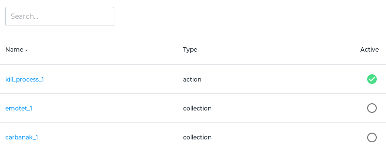

# RESPONSE Extensions
The [Infocyte](https://www.infocyte.com) platform is an extensible threat hunting solution. In addition to
the plethora of data analyzed by default, users are able to define their own methods of collection as well as
actions to respond to breaches. Here you will find examples and contributed extensions which can be easily loaded
into the Infocyte platform.

**This repo contains:**
- [Extension Overview](#overview)
- [Usage Instructions](#usage)
- [API Reference](#api)
- [Examples](#examples)
- [Contributing Instructions](#contributing)
- [Feature Requests](#feature-requests)

### Overview
The Infocyte RESPONSe extension system is build on top of [Lua 5.3](https://www.lua.org), which provides a small but featureful
library of built in functions. This includes file system, string , I/O, math, operations (among others). Refer
to the [Lua Reference Manual](https://www.lua.org/manual/5.3/contents.html) for detailed documentation on usage.

In addition to these standard capabilities, Infocyte HUNT exposes a number of features to the language that make
interacting with the underlying system more powerful and convenient. This extended language is the real engine
that powers the extension system. With these enhancements, extension authors can easily perform web requests,
access the windows registry, terminate running processes, even add items to the existing result set retrieved
by the standard HUNT platform's collection parameters.

### Usage
Configuring of new extensions is a very simple process. After logging into your Infocyte HUNT instance (with 
an administrator role) simply navigate to `Admin->Extensions`. Here you can see the list of current extensions
loaded into the system:



Clicking on an existing item will allow you to view the extension body and edit it. To add a new extension click
the `Add Extension`, this will take to you to the extension editor:


You can copy and paste an extension from this repository (check the [contrib folder](/contrib) for submitted extensions),
or start from scratch and write your own.

Hitting save will perform a syntax validation and if everything checks out, will save the newly created extension
for use in HUNT. To make the extension available to deploy during a scan, make sure you click the `Active` column
to enable it as an option.

### API Reference
Below is documentation surrounding the extended Lua API developed and provided by Infocyte. This API can be broken
down into various parts:

- [Environmental](#environmental)
- [Network](#network)
- [Web](#web)
- [Process](#process)
- [Registry](#registry)

#### Environmental

##### hunt.log(string)
Captures the input value and saves it to the extension output object to be viewed later in the HUNT application.
It is important to note that this is the only way to make data viewable in HUNT. Any other output will be ignored.

##### hunt.env.os()
Returns a string representing the current operating system.

##### hunt.env.has_python()
Returns a boolean indicating if any version of Python is available on the system.

##### hunt.env.has_python2()
Returns a boolean indicating if Python 2 is available on the system.

##### hunt.env.has_python3()
Returns a boolean indicating if Python 3 is available on the system.

##### hunt.env.has_powershell()
Returns a boolean indicating if Powershell is available on the system.

##### hunt.env.has_sh()
Returns a boolean indicating if the bourne shell is available on the system.

#### Network

##### hunt.net.api()
Returns a string value of the HUNT instance URL the script is currently attached to. This can be empty if the
script is being executed as a test or off-line scan.

##### hunt.net.api_ipv4()
Returns a list of IPv4 addresses associated with the HUNT API, this list can be empty if executed under testing or as an
off-line scan;

##### hunt.net.api_ipv6()
Returns a list of IPv6 addresses associated with the HUNT API, this list can be empty if executed under testing or as an
off-line scan;

##### hunt.net.nslookup(string)
Returns a list of IP addresses associated with the input item. This will be empty if lookup fails.

##### hunt.net.nslookup4(string)
Returns a list of IPv4 addresses associated with the input item. This will be empty if lookup fails.

##### hunt.net.nslookup6(string)
Returns a list of IPv6 addresses associated with the input item. This will be empty if lookup fails.

#### Web
For web requests, a proxy field is available but optional (can be set to `nil` if not needed). The
format for using a proxy is `user:password@proxy_address:port`. 

The `enforce_tls` option controls whether or not any TLS/SSL server certificate should be validated.
This is helpful when using internal web servers that may not have a globally recognized certificate.

##### hunt.web.download_file(url: string, local_file: string, enforce_tls: bool, proxy: string)
Retrieves data from `url` and writes the body contents to `local_file`.

##### hunt.web.download_data(url: string, enforce_tls: bool, proxy: string)
Returns the response body as raw bytes.

#### Process

##### hunt.process.kill_pid(pid: number)
Ends the process identified by `pid`

##### hunt.process.kill_process(name: string)
Ends any process with `name`.

#### Registry
These registry functions interact with the `Nt*` series of Windows APIs and therefore use `\Registry\Users`
style of registry paths. These functions will return empty values when run on platforms other than Windows.

##### hunt.registry.list_keys(path: string)
Returns a list of registry keys located at `path`. This will be empty on failure.

##### hunt.registry.list_values(path: string)
Returns a list of registry values located at `path`. This will be empty on failure.

### Examples

```lua
hunt.log("My first HUNT extension!")
```

### Contributing
Infocyte welcomes any contributions to this repository. The preferred method is to 
[open a pull request](https://help.github.com/en/articles/about-pull-requests)
with a description of the incoming extension. 

### Feature Requests
If there is a feature you would like seen added to the extension system, feel free to open an issue with a
description of the new capability!
